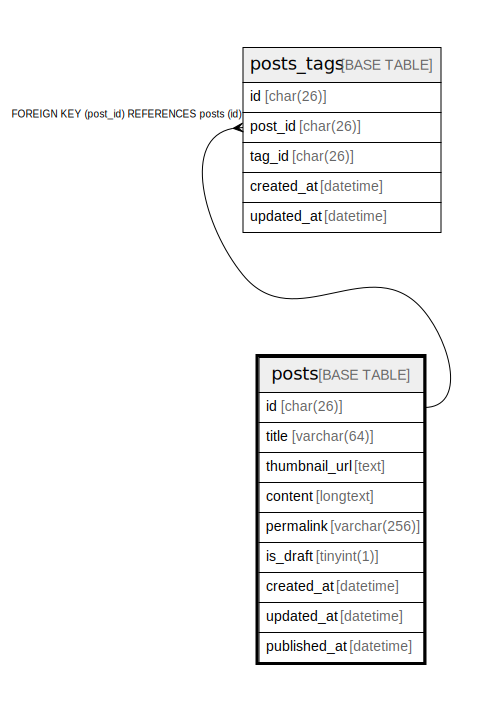

# posts

## Description

<details>
<summary><strong>Table Definition</strong></summary>

```sql
CREATE TABLE `posts` (
  `id` char(26) COLLATE utf8mb4_unicode_ci NOT NULL,
  `thumnail_url` text CHARACTER SET utf8mb4 COLLATE utf8mb4_unicode_ci NOT NULL,
  `content` longtext CHARACTER SET utf8mb4 COLLATE utf8mb4_unicode_ci NOT NULL,
  `permalink` varchar(256) CHARACTER SET utf8mb4 COLLATE utf8mb4_unicode_ci NOT NULL,
  `is_draft` tinyint(1) NOT NULL DEFAULT '0',
  `created_at` datetime NOT NULL DEFAULT CURRENT_TIMESTAMP,
  `updated_at` datetime NOT NULL DEFAULT CURRENT_TIMESTAMP ON UPDATE CURRENT_TIMESTAMP,
  PRIMARY KEY (`id`),
  UNIQUE KEY `permalink` (`permalink`)
) ENGINE=InnoDB DEFAULT CHARSET=utf8mb4 COLLATE=utf8mb4_unicode_ci
```

</details>

## Columns

| Name | Type | Default | Nullable | Extra Definition | Children | Parents | Comment |
| ---- | ---- | ------- | -------- | --------------- | -------- | ------- | ------- |
| id | char(26) |  | false |  | [tags](tags.md) |  |  |
| thumnail_url | text |  | false |  |  |  |  |
| content | longtext |  | false |  |  |  |  |
| permalink | varchar(256) |  | false |  |  |  |  |
| is_draft | tinyint(1) | 0 | false |  |  |  |  |
| created_at | datetime | CURRENT_TIMESTAMP | false | DEFAULT_GENERATED |  |  |  |
| updated_at | datetime | CURRENT_TIMESTAMP | false | DEFAULT_GENERATED on update CURRENT_TIMESTAMP |  |  |  |

## Constraints

| Name | Type | Definition |
| ---- | ---- | ---------- |
| permalink | UNIQUE | UNIQUE KEY permalink (permalink) |
| PRIMARY | PRIMARY KEY | PRIMARY KEY (id) |

## Indexes

| Name | Definition |
| ---- | ---------- |
| PRIMARY | PRIMARY KEY (id) USING BTREE |
| permalink | UNIQUE KEY permalink (permalink) USING BTREE |

## Relations



---

> Generated by [tbls](https://github.com/k1LoW/tbls)
